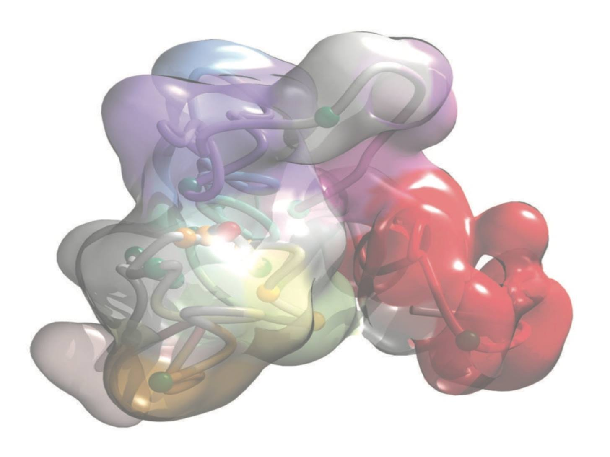

## Course Description

3C-based methods, such as Hi-C, produce a huge amount of raw data as pairs of DNA reads that are in close spatial proximity in the cell nucleus. Overall, those interaction matrices have been used to study how the genome folds within the nucleus, which is one of the most fascinating problems in modern biology. The rigorous analysis of those paired-reads using computational tools has been essential to fully exploit the experimental technique, and to study how the genome is folded in space. Currently, there is a clear expansion on the wealth of data on genome structure with the availability of many datasets of Hi-C experiments down to 1Kb resolution (see for example: http://hic.umassmed.edu/welcome/welcome.php ; http://promoter.bx.psu.edu/hi-c/view.php or http://www.aidenlab.org/data.html).

In this course, participants will learn to use **TADbit**, a software designed and developed to manage all dimensionalities of the Hi-C data:
* 1D - Map paired-end sequences to generate Hi-C interaction matrices
* 2D - Normalize matrices and identify constitutive domains (TADs, compartments)
* 3D - Generate populations of structures which satisfy the Hi-C interaction matrices
* 4D - Compare samples at different time points

Participants can bring specific biological questions and/or their own 3C-based data to analyze during the course. At the end of the course, participants will be familiar with the TADbit software and will be able to fully analyze Hi-C data. Although the TADbit software is central in this course, alternative software will be discussed for each part of the analysis.

## Target Audience

The course design is oriented towards experimental researchers and bioinformaticians at the graduate and post-graduate levels. The last edition of this course was attended by people with different backgrounds and interested in the genome organization.

It is likely that the participants to this course aim at getting involved in generating Hi-C data for chromosome structure determination or that they just want to be able to correctly interpret and analyse publicly available data.

## Detailed Program

All the datasets used for this training course is available throughout the documentation.

<table>
  <tbody>
    <tr>
      <th>Days</th>
      <th>Lectures (pdf)</th>
      <th>Core pipeline (notebooks)</th>
      <th>Annex (notebooks)</th>
    </tr>
    <tr>
     <td><strong>Day 1</strong></td>
     <td>
       <ul>
        <li> <a href="./assets/material/Presentations/Day1/01_20180917_Welcome.pdf">Welcome</a></li>
        <li> <a href="./assets/material//Presentations/Day1/02_20180917_introduction_to_structure_determination.pdf">Intro structure determination</a></li>
        <li> <a href="./assets/material/Presentations/Day1/03_20180917_3D-genomes_overview.pdf">3D Genomes overview</a></li>
        <li> <a href="./assets/material/Presentations/Day1/04_20180917_Intro_TADbit.pdf">Intro TADbit</a></li>
        <li> <a href="./assets/material/Presentations/Day1/05_20180917_NGS_for_HiC.pdf">NGS for HiC</a></li>
        <li> <a href="./assets/material/Presentations/Day1/06_20180917_linux.pdf">Intro UNIX</a></li>
        <li> <a href="./assets/material/Presentations/Day1/07_20180917_python.pdf">Intro Python</a></li>
       </ul>
     </td>
     <td>
       <ul>
        <li> <a href="./assets/material/Notebooks/00-Hi-C%20quality%20check.ipynb">Hi-C Quality check</a></li>
        <li> <a href="./assets/material/Notebooks/01-Mapping.ipynb">Mapping</a></li>
        <li> <a href="./assets/material/Notebooks/02-Parsing%20mapped%20reads.ipynb">Parsing mapped reads</a></li>
       </ul>
    </td>
    <td>
       <ul>
        <li> <a href="./assets/material/Notebooks/A0-Preparing%20your%20computer%20for%20HiC%20data%20analysis.ipynb">Software installation</a></li>
        <li> <a href="./assets/material/Notebooks/A1-Preparation%20reference%20genome.ipynb">Prepare reference genome</a></li>
        <li> <a href="./assets/material/Notebooks/A2-Download%20published%20Hi-C%20experiments.ipynb">Download Hi-C experiment</a></li>
       </ul>
    </td>
   </tr>
    <tr>
     <td><strong>Day 2</strong></td>
     <td>
       <ul>
        <li> <a href="./assets/material/Presentations/Day2/01_20180918_Summary_of_day_1.pdf">Morning wrap up</a></li>
        <li> <a href="./assets/material/Presentations/Day2/02_20180918_Chromatin_and_3Cs.pdf">Chromatin and 3Cs</a></li>
        <li> <a href="./assets/material/Presentations/Day2/03_20180918_TADbit.pdf">TADbit</a></li>
        <li> <a href="./assets/material/Presentations/Day2/04_20180918_Applications(II)_Caulobacter.pdf">Applications (I): Caulobacter</a></li>
       </ul>
     </td>
     <td>
       <ul>
        <li> <a href="./assets/material/Notebooks/03-Filtering%20mapped%20reads.ipynb">Filterind reads</a></li>
        <li> <a href="./assets/material/Notebooks/04-Bin-filtering%20and%20normalization.ipynb">Normalization</a></li>
       </ul>
    </td>
    <td>
       <ul>
        <li> <a href="./assets/material/Notebooks/A3-Compare%20and%20merge%20Hi-C%20experiments.ipynb">Compare/merge experiments</a></li>
       </ul>
    </td>
   </tr>
   <tr>
     <td><strong>Day 3</strong></td>
     <td>
       <ul>
        <li> <a href="./assets/material/Presentations/Day3/01_20180919_Summary_of_day_2.pdf">Morning wrap up</a></li>
        <li> <a href="./assets/material/Presentations/Day3/02_20180919_Applications(II)_TAD_hormone.pdf">Applications(II) TAD hormone</a></li>
        <li> <a href="./assets/material/Presentations/Day3/02_20180920_Applications(IIIa)_SOX2Dynamics.pdf">Applications (III) SOX2 Dynamics</a></li>
       </ul>
     </td>
     <td>
       <ul>
        <li> <a href="./assets/material/Notebooks/05-Compartments%20and%20TADs.ipynb">Compartments and TADs</a></li>
       </ul>
    </td>
    <td>
       <ul>
        <li> <a href="./assets/material/Notebooks/A4-Align%20and%20compare%20TADs.ipynb">Align and compare TADs</a></li>
       </ul>
    </td>
   </tr>
   <tr>
     <td><strong>Day 4</strong></td>
     <td>
      <ul>
        <li> <a href="./assets/material/Presentations/Day4/01_20180920_Summary_of_day_3.pdf">Morning wrap up</a></li>
        <li> <a href="./assets/material/Presentations/Day4/03_20180920_Applications(IIIb)_IMGR.pdf">Applications(IV): Super-resolution Imaging and modeling</a></li>
       </ul>
     </td>
     <td>
       <ul>
        <li> <a href="./assets/material/Notebooks/06a-Modeling%20-%20parameter%20optimization.ipynb">Parameter optimization</a></li>
        <li> <a href="./assets/material/Notebooks/06b-Modeling%20-%20model%20optimization.ipynb">Model optimization</a></li>
       </ul>
    </td>
    <td>
       <ul>
        <li> <a href="./assets/material/Notebooks/A5-Modeling%20-%20analysis%20of%203D%20models.ipynb">Analysis of 3D models</a></li>
       </ul>
    </td>
   </tr>
    <tr>
     <td><strong>Day 5</strong></td>
     <td>
      <ul>
        <li> <a href="./assets/material/Presentations/Day5/01_20180921_Summary_of_day_4.pdf">Morning wrap up</a></li>
        <li> <a href="./assets/material/Presentations/Day5/02_20180921_MuG.pdf">Multiscale Genomics</a></li>
        <li> <a href="./assets/material/Presentations/Day5/NucDyn_3DAROC18.pdf">Nucleosome dynamics</a></li>
        <li> <a href="./assets/material/Presentations/Day5/3DAROC_mcdna_chromdyn_juergenwalther_21_09_18.pdf">MC-DNA and Chromatin Dynamics</a></li>
       </ul>
     </td>
     <td></td>
     <td></td>
   </tr>
  </tbody>
</table>

---

### [Learning Objectives and Course Pre-requisites](pages/objectives_prerequisites.md)

### [Instructors](pages/instructors.md)

---

The source for this course webpage is [in github](https://github.com/GTPB/3DAROC20).

 

 3DAROC20 by GTPB is licensed under a <a rel="license" href="http://creativecommons.org/licenses/by/4.0/">Creative Commons Attribution 4.0 International License</a>.
