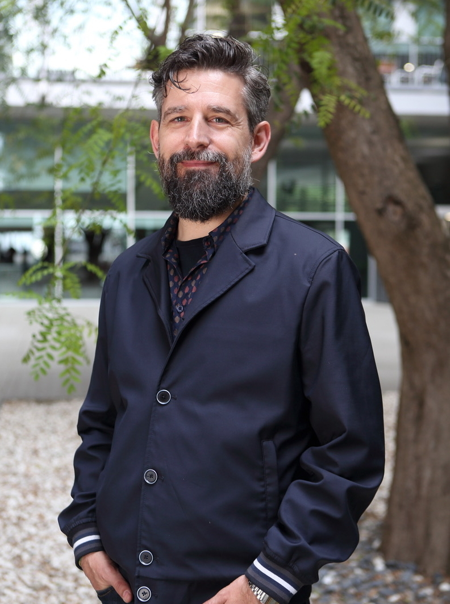
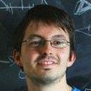
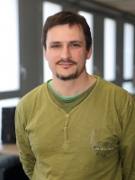

## Marc A. Marti-Renom
**Affiliation:** Centro Nacional de Análisis Genómico (CNAG) and Center for Genomic Regulation (CRG), Barcelona, ES

**Marc A. Marti-Renom** obtained a PhD in Biophysics from the Universidad Autonoma de Barcelona (UAB) where he worked on protein folding under the supervision of B. Oliva, F.X. Aviles and M. Karplus (Noble Laureate for Chemistry 2013). After that, he went to the US for a postdoctoral training on protein structure modelling at the Sali Lab (Rockefeller University) as the recipient of the Burroughs Wellcome Fund fellowship. Later on, Marc was appointed Assistant Adjunct Professor at UCSF. Between 2006 and 2011, he headed the Structural Genomics Group at the CIPF in Valencia (Spain). Currently, Marc is an ICREA research professor and leads the Structural Genomics Group at the National Center for Genomic Analysis - Centre for Genomic Regulation (CNAG-CRG) in Barcelona. His research group employs the laws of physics and the rules of evolution to develop and apply experimental and computational methods for elucidating the 3D structures of macromolecules and their complexes. 
Between 2012 and 2018, Marc was an Associate Editor of the PLoS Computational Biology journal and has published over 100 articles in international peer-reviewed journals. He coordinated two international teams funded by the EU (Era-Net Pathogenomics Grant) and the HFSP (Research Grants Award). Since 2014, he became the co-PI on the 4DGenome Grant funded by the ERC Synergy program as well as the co-PI on the MuG Research project funded by the European Commission H2020 program.Over the last years, Marc played a key role in Europe to promote the 4DNucleome Initiative (http://www.4dnucleome.eu), which recently joined forces with the single-cell and organoid communities to form the LifeTime Initiative (https://lifetime-fetflagship.eu) towards a FET-FLAGSHIP in Europe to which he is a Steering Committee Member. Marc collaborates in GTPB as an instructor since 2008. PGDD08 - Pharmacogenomics: new opportunities for drug discovery; SG09 - Structural Genomics; SGDD10 - Structural Genomics and Drug Design; CSDM14-Chromosome structure determination using modelling and Hi-C data; 3DAROC16 - 
3C-based data analysis and 3D reconstruction of chromatin folding; 3DAROC18 - 3C-based data analysis and 3D reconstruction of chromatin folding.

 

---

### Marco Di Stefano
**Affiliation:** Centro Nacional de Análisis Genómico (CNAG) and Center for Genomic Regulation (CRG), Barcelona, ES

Biosketch

 
 
 
 
 
 
 
 

---

## David Castillo
**Affiliation:** Centro Nacional de Análisis Genómico (CNAG) and Center for Genomic Regulation (CRG), Barcelona, ES

**David Castillo**  obtained his MSc in Photonics from the Universitat Politècnica de Catalunya in Barcelona (Spain) where he worked in Super-resolution microscopy. He has a background in Physics and Engineering.

He works as a technician in the Structural Genomics team of Marc A. Martí-Renom at CNAG-CRG (Barcelona), developing tools for the analysis, modelling and visualization of HiC data.

He is also interested in the integration of microscopy to the modeling of genomic 3D structures.

 
 
 
 

### Back

Back to [main page](../index.md).
